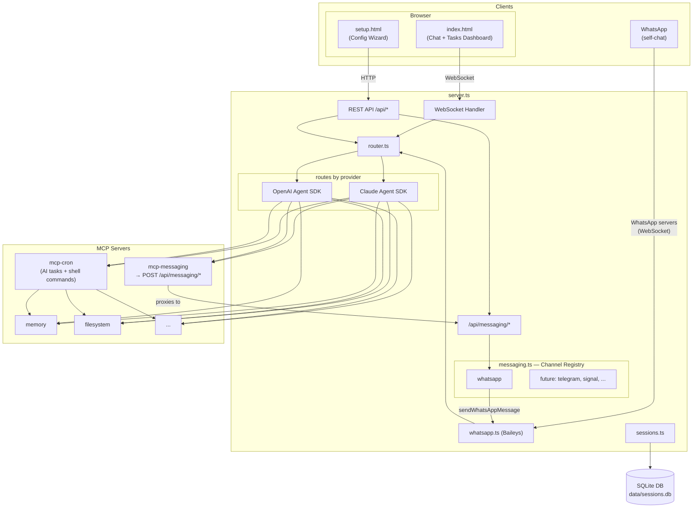

# Architecture

## Messaging Flow

When an AI agent (main chat or mcp-cron task) wants to send a message:

1. **Agent** calls `send_message` tool via the `mcp-messaging` MCP server (stdio)
2. **mcp-messaging** proxies the call to `POST /api/messaging/send` on localhost
3. **server.ts** validates the request and calls `sendMessage()` from the channel registry
4. **messaging.ts** looks up the channel (e.g. "whatsapp") and delegates to its `SendFn`
5. **whatsapp.ts** `sendWhatsAppMessage()` sends via the Baileys socket, splitting long messages

The channel registry (`src/messaging.ts`) is a simple `Map<string, SendFn>`. Adding a new channel (Telegram, Signal, etc.) requires:
1. A connection module with a send function matching `(message: string, to?: string) => Promise<number>`
2. A `registerChannel()` call at startup and in `reloadServices()`

No changes to the MCP server, HTTP endpoints, or agent prompts are needed.
